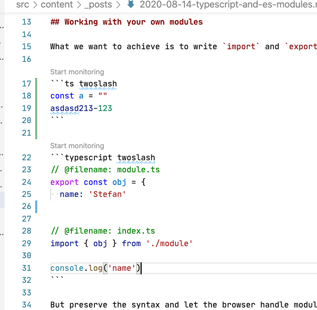
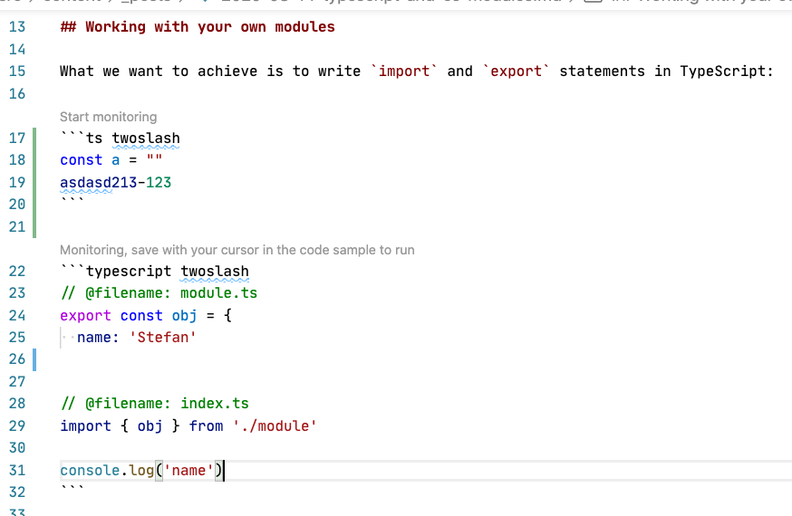
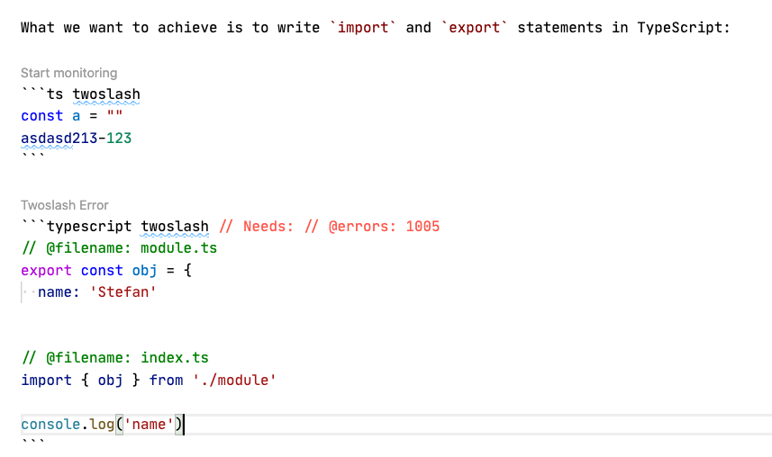
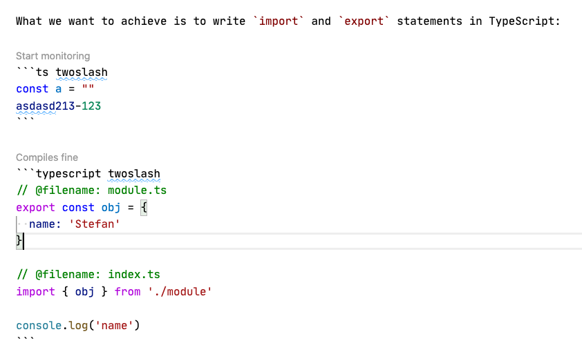

# Moved

https://github.com/shikijs/twoslash/blob/main/extensions/vscode-twoslash/

# vscode-twoslash README

Runs Twoslash code samples in your IDE to determine if they are correct.

### What it does

This extension adds a "Monitor" button above Twoslash code-samples:

Selecting a code sample, means that the extension will start monitoring it:

Pressing save _when_ your cursor is inside a monitored code sample will run Twoslash on it:

You can then iterate until you're done:

### Notes

The start character index of the code sample is used to keep track of what is monitored, if you edit some text above then it'll get dropped from being monitored. You can re-click the button.
